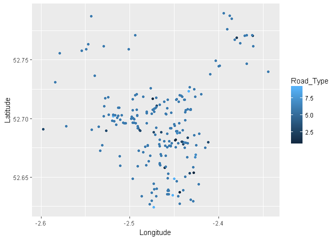
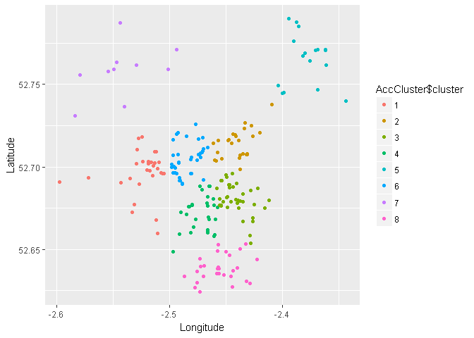

<br/>

## Using Topology for Data Analysis

<br/>

When researching data we want to find features that help us understand the information. We look for insight in areas like Machine Learning or other fields in Mathematics and Artificial Intelligence. 

I want to present here a tool initially coming from Mathematics that can be used for exploratory data analysis and give some geometric insight before applying more sophisticated algorithms.

The tool I want to describe is __Persistent Homology__, member of a set of algorithms known as *Topological Data Analysis* __[1,2]__. In this post I will describe the basic methodology when facing a common data analysis scenario: *clustering*.

 <br/>
 
#### SOME IDEAS FROM TOPOLOGY

<br/>

A *space* is a set of data with no structure. The first step is to give some structure that can help us understand the data and also make it more interesting. If we define a notion of how close are all the points we are giving structure to this space. This notion is a neighborhood and it tells us if two points are close. With this notion we already have important information: we now know if our data is connected.

The neighborhoods can be whatever we want and the data points can be numbers or words or other type of data. These concepts and ideas are the subject of study of Topology. For us, Topology is the study of the shape of data.

We need to give some definitions, but all are very intuitive. From our point space or dataset, we define the following notion: a simplex. It is easy to visualize what we mean.

</img>

So, a 0-simplex is a point. Every point in our data is a 0-simplex. If we have a "line" joining two points that is a 1-simplex, and so on. Of course, a 4-simplex and higher analogues are difficult for us to visualize. We can immediately see what connectedness is. In the image, we have four connected components, a 0-simplex, a 1-simplx, a 2-simplex and a 3-simplex. If we join them with, for example lines we will connect the dataset into one single component. Like this:

</img>

The next notion is the neighborhood. We'll use euclidean distance to say when our points are close, we'll use circles as neighborhoods. This distance depends on a parameter, the radius of the circle. If we change these parameter we change the size of the neighborhood.

</img>

Persistence is an algorithm that changes this parameter from zero to a very large value, one that covers the entire set. With this maximal radius we enclose all our dataset. The algorithm __[2]__ can be put as follows:

1. We construct a neighborhood for each point and set the parameter to zero.

2. Increment the value of this parameter and if two neighborhoods intersect, draw a line between the points. These will form a 1-simplex. After that an n-simplex will form at each step until we fill all the space with lines.

3. Describe in some way the holes of our data has as we increase the parameter. Keep track when they emerge and when they disappear. If the holes and voids persist as we move the parameter, we can say that we found an important feature of a our data.

</img>

The "some way" part is called Homology and is a field in Mathematics specialized in detecting the structure of space. The reader can refer to the bibliography for these concepts __[1]__.

This algorithm can be shown to detect holes and voids in datasets. *An achievement we can mention is that Persistent Homology was used for detecting a new subtype of breast cancer using it to detect clusters in images __[3]__.*

<br/>

#### VEHICLE ACCIDENTS DATASET

<br/>

The dataset is available in __[4]__. It's about car accidents and has some specifications. We subset only the data we need for this exersice, but a lotmore can be done. 
We use an ID of the accident, the spatial coordinates and some categorical data: Local highway authority and Road Type. That's all we need to start. 

First, the whole data looks like this:


```
## 'data.frame':	140056 obs. of  32 variables:
##  $ Accident_Index                             : Factor w/ 140056 levels "201501BS70001",..: 1 2 3 4 5 6 7 8 9 10 ...
##  $ Location_Easting_OSGR                      : int  525130 526530 524610 524420 524630 525480 526890 527590 524170 525010 ...
##  $ Location_Northing_OSGR                     : int  180050 178560 181080 181080 179040 179530 178940 178660 180930 181200 ...
##  $ Longitude                                  : num  -0.198 -0.179 -0.206 -0.208 -0.206 ...
##  $ Latitude                                   : num  51.5 51.5 51.5 51.5 51.5 ...
##  $ Police_Force                               : int  1 1 1 1 1 1 1 1 1 1 ...
##  $ Accident_Severity                          : int  3 3 3 3 2 3 3 3 3 3 ...
##  $ Number_of_Vehicles                         : int  1 1 1 1 2 2 2 2 2 2 ...
##  $ Number_of_Casualties                       : int  1 1 1 1 1 1 1 1 1 2 ...
##  $ Date                                       : Factor w/ 365 levels "01/01/2015","01/02/2015",..: 133 133 133 145 97 169 169 205 181 229 ...
##  $ Day_of_Week                                : int  2 2 2 3 6 5 5 1 6 3 ...
##  $ Time                                       : Factor w/ 1440 levels "","00:01","00:02",..: 1126 471 1089 461 451 597 550 931 381 945 ...
##  $ Local_Authority_.District.                 : int  12 12 12 12 12 12 12 12 12 12 ...
##  $ Local_Authority_.Highway.                  : Factor w/ 207 levels "E06000001","E06000002",..: 112 112 112 112 112 112 112 112 112 112 ...
##  $ X1st_Road_Class                            : int  5 6 4 4 3 3 3 6 5 6 ...
##  $ X1st_Road_Number                           : int  0 0 415 450 315 315 3218 0 0 0 ...
##  $ Road_Type                                  : int  6 6 6 6 6 6 6 6 6 6 ...
##  $ Speed_limit                                : int  30 30 30 30 30 30 30 30 30 30 ...
##  $ Junction_Detail                            : int  3 3 2 6 6 3 6 0 3 3 ...
##  $ Junction_Control                           : int  4 4 4 4 2 4 2 -1 4 4 ...
##  $ X2nd_Road_Class                            : int  6 3 6 6 3 5 3 -1 6 6 ...
##  $ X2nd_Road_Number                           : int  0 3218 0 0 3220 0 3218 0 0 0 ...
##  $ Pedestrian_Crossing.Human_Control          : int  0 0 0 0 0 0 0 0 0 0 ...
##  $ Pedestrian_Crossing.Physical_Facilities    : int  0 0 1 0 5 4 5 0 1 0 ...
##  $ Light_Conditions                           : int  4 1 4 1 1 1 1 1 1 1 ...
##  $ Weather_Conditions                         : int  1 1 2 1 2 1 8 1 1 8 ...
##  $ Road_Surface_Conditions                    : int  1 1 2 2 2 2 2 1 1 1 ...
##  $ Special_Conditions_at_Site                 : int  0 0 0 0 0 0 0 0 0 0 ...
##  $ Carriageway_Hazards                        : int  0 0 0 0 0 0 0 0 0 0 ...
##  $ Urban_or_Rural_Area                        : int  1 1 1 1 1 1 1 1 1 1 ...
##  $ Did_Police_Officer_Attend_Scene_of_Accident: int  1 1 1 2 2 1 1 1 1 1 ...
##  $ LSOA_of_Accident_Location                  : Factor w/ 28738 levels "","E01000001",..: 2380 2375 2387 2425 2369 2371 2376 2413 2430 2386 ...
```

We start by subseting the data frame with only the variables we are interested. But with a summarise to see it grouped by the highway local authority.


```r
Acc <- Accidents %>% 
  filter(!is.na(Road_Type)) %>% 
  select(Accident_Index,Longitude,Latitude,Local_Authority_.Highway.,Road_Type) %>%
  group_by(Local_Authority_.Highway.) %>% 
  summarise(n())
Acc
```

```
## # A tibble: 207 x 2
##    Local_Authority_.Highway. `n()`
##                       <fctr> <int>
##  1                 E06000001   136
##  2                 E06000002   304
##  3                 E06000003   190
##  4                 E06000004   311
##  5                 E06000005   207
##  6                 E06000006   224
##  7                 E06000007   505
##  8                 E06000008   398
##  9                 E06000009   373
## 10                 E06000010   748
## # ... with 197 more rows
```

In the last output we select any of this subsets and take a look to the road type:


```r
Acc_test <- Accidents %>% 
  filter(!is.na(Road_Type)) %>% 
  filter(Local_Authority_.Highway.== "E06000020") %>%
  select(Accident_Index,Longitude,Latitude,Local_Authority_.Highway.,Road_Type) %>% 
  group_by(Road_Type) %>% 
  summarise(n())
Acc_test
```

```
## # A tibble: 6 x 2
##   Road_Type `n()`
##       <int> <int>
## 1         1     8
## 2         2     1
## 3         3    16
## 4         6   193
## 5         7     4
## 6         9     5
```

We can see that most accidents under this local auhority happened under conditions of the road of type 6 and so on... we can also check weather conditions, road conditions, etc. For our purposes we want to visualize spatial data according to this categories:


```r
Acc_test <- Accidents %>% 
  filter(!is.na(Road_Type)) %>% 
  filter(Local_Authority_.Highway.== "E06000020") %>%
  select(Accident_Index,Longitude,Latitude,Local_Authority_.Highway.,Road_Type) 
Acc_test %>% 
  ggplot(aes(Longitude, Latitude, color = Road_Type)) + geom_point()
```

<!-- -->

We can see that some clusters form with respect to spatial position. Before we procede with the usual machinery in Machine Learning, we apply the topological method introduced before, Persistence Homology, to this subset of the data.

<br/>

#### PERSISTENT HOMOLOGY

<br/>

We use the [TDA package](https://CRAN.R-project.org/package=TDA).

It's a great package and has many features, but we'll only use a couple to show that topological data analysis is a building block of machine learning and can give geometric insight *a priori* over our data.

We construct the parameter and use *gridDiag* function:


```r
#You can find how to construct this example in TDA package documentation
#library(TDA)

Acc_vector <- cbind("V1" = Acc_test$Longitude, "V2" = Acc_test$Latitude)

xlimit <- c(-2.65, -2.30) 
ylimit <- c(52.5, 52.8)

by <- 0.004

Diag <- gridDiag(X = Acc_vector, FUN = distFct, lim = cbind(xlimit, ylimit), by = by, sublevel = FALSE, library = "Dionysus", printProgress = FALSE, maxdimension = 0)

#To plot the barcode just use the info in the list "diagram":
plot(Diag[["diagram"]],barcode=TRUE)
```

<!-- -->

__Comments__:

1. You can find how to construct this example in __TDA__ package documentation.

2. First we need a vector with the spatial data of our accidents: create Acc_vector.

3. We can find the limits of the interval from the plot of by inspection on the dataset with a quick summary.

4. The next parameter *by* is the step size of the grid in which we are looking (we can give a vector to find the best of the steps).

5. *gridDiag* computes the persistence diagram or barcode of the births and deaths of the connected components we are interested.

6. *maxdimension=0* because we only want the $0$-th Homology. *distFct* is the radius of the neighborhood as the infimum of the squared distance.

7. The __Barcode__ is a visualization of the birth and death of connected components. We can see that they form as the radius of the neighborhoodsincrease but also die as the simplex gets high dimensional.

<br/>

#### PASS TO MACHINE LEARNING

<br/>

From the barcode we can expect that 6 to 8 clusters can form and persist. Now we pass this information to a Machine Learning algorithm like the K-MEANS algorithm to find this clusters and the positions of the accidents:


```r
set.seed(10)
AccCluster <- kmeans(Acc_test[, 2:3], 8, nstart = 10)

AccCluster$cluster <- as.factor(AccCluster$cluster)
#Acc_test %>% ggvis(x = ~Longitude, y = ~Latitude, fill = ~AccCluster$cluster) %>% layer_points()
Acc_test %>% ggplot(aes(Longitude,Latitude,color=AccCluster$cluster))+geom_point()
```

<!-- -->

<br/>

#### CONCLUSIONS:

<br/>

Persistence is a topological property. The construction we mentioned before is called a *filtration*. Over these filtrations we calculate the dimensions of the Homology groups and this gives us the important information. The dimension of the $0$-th Homology group or $H_0$ gives us the number of connected components of our space of data. The first Homology tell us the number of holes of the space. Second Homology tell's us about voids, ans so on. 

We only talked about $H_0$ because our data is in $2D$ spatial dimensions. But we point out that this must not be a limitation. The topological analysis is not limited to spatial data.

As Machine Learning techniques are used to find new features in data, topological data analysis can be used to confirm robustness of those results and also bring to light new features hidden in the structure of data that is of topological nature.

<br/>

#### SOME REFERENCES:

<br/>

1. Carlsson, Gunnar; Zomorodian, Afra; Collins, Anne; Guibas, Leonidas J. (2005-12-01). "Persistence barcodes for shapes". International Journal of Shape Modeling. 11 (02): 149-187.

2. Carlsson, Gunnar (2009-01-01). "Topology and data". Bulletin of the American Mathematical Society. 46 (2): 255-308.

3. Nicolau M., Levine A., Clarsson G. (2010-07-23), "Topology based data analysis identifies a subgroup of breast cancer with a unique mutational profile and excellent survival", PNAS, 108(17).

4. https://data.gov.uk/

<br/>


